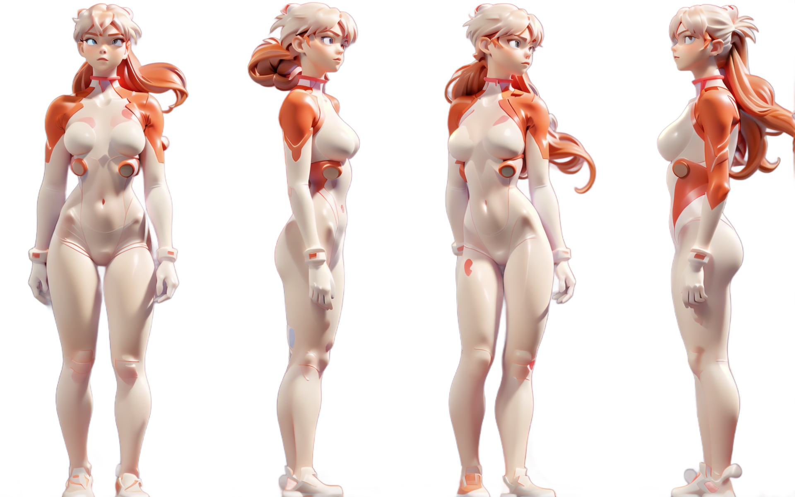
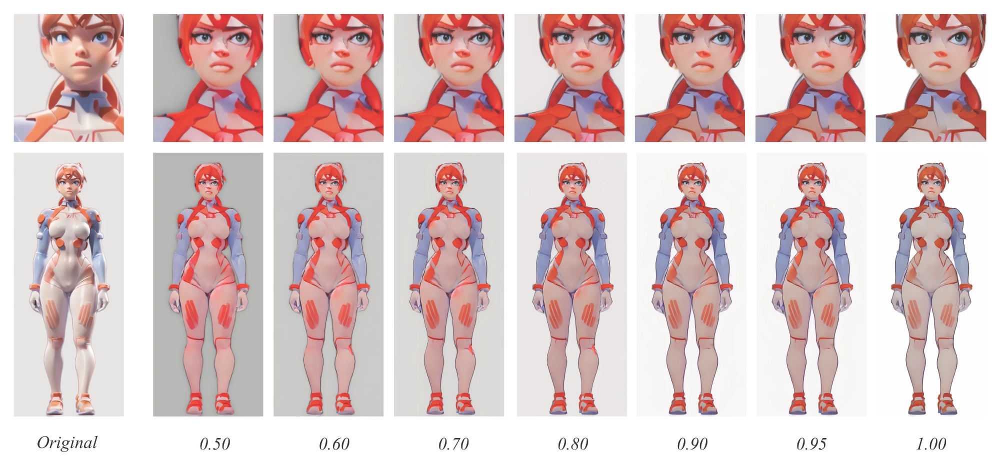
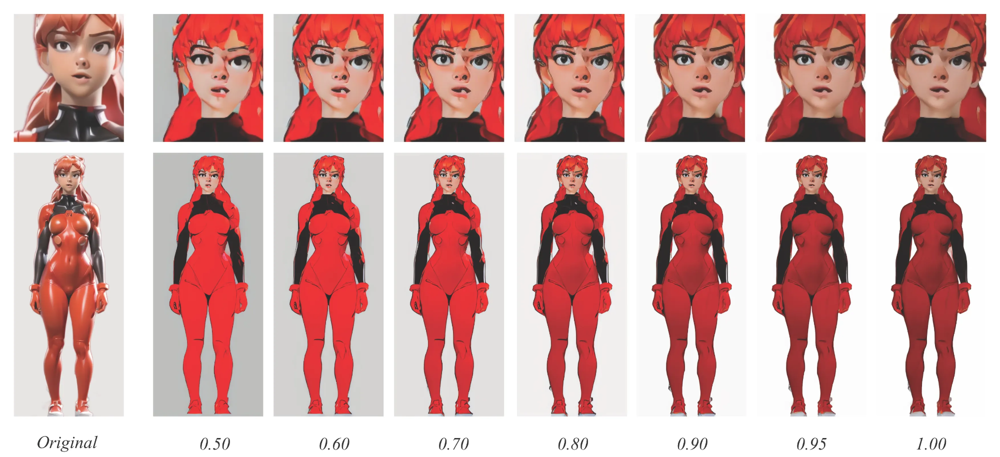

# **多视图 3D 模型生成工作流** *Exploring Multi-view Consistency in AI-based 3D Generation*

### ——从文本生成到三维重建的智能化探索

> Diffusion, AI, Hunyuan3d

**基于Hunyuan3D与ComfyUI框架，实现从 *text2image* 到 *image2model* 的全过程。项目聚焦于多视图一致性与可控性的核心问题，通过LoRA 微调与ControlNet 姿态控制，实现了稳定多视角 3D 生成流程，并以3D 打印验证完成从算法到制造的闭环。**

### **项目概述｜ Content**

本项目以 “多视图一致性” 为研究重点，旨在提升 AI 模型在三维生成中的结构稳定性与视觉连续性。在**ComfyUI**平台上构建以**Hunyuan3D**为核心的工作流，集成**IPAdapter、LoRA、ControlNet**
等模块，使系统能够在文本提示下自动生成多角度一致、姿态可控的图像序列，并进一步重建为三维模型。该工作流为后续的建模、纹理生成与制造验证提供了实验性基础，也验证了**设计推理 → 算法生成 → 实体输出**的完整路径。

### **工作流搭建与核心逻辑**

_*ComfyUI 工作流示意*_

在 ComfyUI 中构建完整节点网络，以 **Hunyuan3D** 作为生成核心，串联文本输入、IPAdapter 特征匹配、ControlNet 姿态控制、LoRA 权重微调等模块。

该工作流不仅支持多视图生成，也为模型控制提供了灵活接口，使得不同阶段可以针对性地调整控制强度与特征保持性。

### **多视图一致性实验**

_*视图控制对比实验*_
为验证多视角生成效果，对比了三种生成方式：

1. 单视图独立推理
    

    
2. 多视图分别推理
    

    
3. 一次性多视图推理
    

    

实验结果表明：**一次性生成多视图** 的方式在控制一致性和参数效率上表现最优，能够更好地保持模型的整体结构和细节连续性。相较之下，多次独立推理虽能更灵活控制角度，但需要额外的特征校正，生成成本更高。

### **姿态控制与特征连续性**

 _*ControlNet 控制效果对比*_

在姿态控制方面，**ControlNet** 是多视图生成的关键环节。通过调整 **OpenPose** 与 **DeepPose** 的介入时域与权重，同时添加3D人物模型的LoRA，模型在姿态一致性与形体稳定性方面表现显著提升。同时，结合 **IPAdapter** 的主视角特征迁移，使不同角度的生成结果能够在视觉上保持统一风格。

---

### **纹理生成与采样优化**

📷 *纹理生成参数对比*

在生成阶段后期，通过调整采样方法与曝光控制，测试了 **Delight** 与 **SampleMultiView** 模型在不同明度、不同采样方法条件下的表现。对比发现，Delight 模型在中等曝光（约 0.95–0.98 区间）下能更稳定生成细腻的表面纹理，而不同的采样方法在平衡速度与质量方面存在差异，为后续渲染优化提供了参考。

### **结论**

该项目在多视图一致性、姿态可控性与纹理生成方面进行了系统性探索，构建了一个可扩展的 AI 生成工作流。研究提升了对 **Diffusion / DiT 模型原理** 的理解，展现了设计与算法的双向互动：以逻辑指导生成模型的构建，以算法思维拓展设计的表达边界。