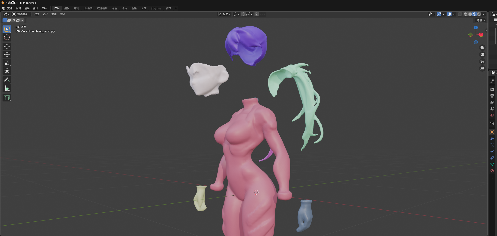
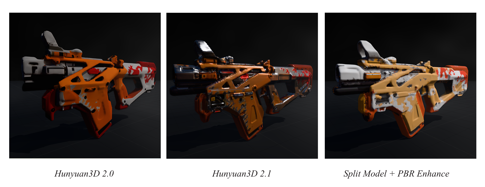

# **Blender 与 AI 3D PBR 资产生成管线** *Pipeline for AI-Assisted PBR Asset Generation with Blender*

### —— 基于 Hunyuan3D 与 ComfyUI 的全流程美术资产创建探索

> Blender, Hunyuan3D, PBR Texture, Computational Geometry  
> [AIGC-PBR with Hunyuan and Blender](https://github.com/MarcoHao/2026-01-23-AIGC_PBR)  

**本项目提出了一套整合AIGC与Blender的3D工作流。打通了从“概念设计、几何生成、组件拆分”到“UV展开、纹理增强”的全链路。通过分件整理与自动化脚本，实现了高质量、可编辑美术资产的快速产出。**

## **工作流搭建与核心逻辑 | Workflow Core Logic**
**概念设计 (Concept)** → **几何生成 (Geometry)** → **组件拆分 (Segmentation)** → **纹理映射 (Mapping)** → **UV 展开 (Unwrapping)** → **PBR 增强 (Material)**
### **1. 概念设计与几何生成**
.png)

首先定义资产的几何形态与风格概念。本环节在此前的 AIGC 3D 人物创建工作流基础上，利用 **QWEN Edit2511** 进行语义理解，结合 **多视角 LoRA** 实现视图一致性推理。在几何生成阶段，深入测试了 **Hunyuan3D** 的两种核心生成模式，验证了其底层技术原理：

**1. 多视图扩散 (Multi-view Diffusion):** 对应 Hunyuan3D 2.0 模式。利用QWEN Edit2511 + 多视角转换LoRA实现人物的多视图推理生成一组正交或透视视角的图像。此模式对细节还原更加准确，适合复杂结构资产。

**2. 稀疏重建 (Sparse-view Reconstruction):** 对应 Hunyuan3D 2.1 (NeRF-based) 模式。基于 LRM (Large Reconstruction Model) 架构，从单张或少量图像直接推断 3D 结构（通常主要利用 NeRF 或 3D Gaussian Splatting 的隐式表达后转 Mesh）。此模式生成速度更快，表面平滑度更高。

### **2. 组件拆分与体素化处理**
>[GitHub - PozzettiAndrea/ComfyUI-Hunyuan3D-Part](https://github.com/PozzettiAndrea/ComfyUI-Hunyuan3D-Part/tree/main)  
>[tencent/Hunyuan3D-Part](https://huggingface.co/tencent/Hunyuan3D-Part/tree/main)

为了提升资产的后续可编辑性，使用 **HunyuanPart** 模型对整体 Mesh 进行语义分割。本项目采用 ComfyUI 本地部署方案（RTX 3090 环境），重点考察了显存限制下的参数调优。

模型拆分涉及复杂的体素化（Voxelization）与八叉树（Octree）计算。在 24GB 显存限制下，通过权衡模型精度与计算开销，确定了最优参数组合：**pc_size = 10240 | octree_resolution = 512**。
**Octree_resolution (八叉树分辨率):** 决定了拆分的空间精度。512 分辨率（需 ~12-16GB 显存）在保持部件边缘锐利与显存占用之间取得了平衡。 **pc_size (点云数量):** 适当降低点云数量支持了更复杂的输入。

*渲染模型与语义分割白膜的对照效果*

*不同octree分辨率的生成效果对比*

*分割模型导入Blender*

实验表明，具有清晰材质区分的输入模型能显著提升 HunyuanPart 的语义理解能力，从而实现更精准的网格补全（Mesh Completion）。

### **3. 材质映射、UV 展开与 PBR 增强**
由于组件拆分会导致原始 UV 信息的丢失及拓扑结构的改变，本阶段在 Blender 中构建了自动化修复脚本：

*贴图映射与展开过程*
**1. 参考模型生成 (Reference Bake):** 将拆分前的原始 Mesh 作为纹理参考源。   
**2. 重映射与聚合 (Remapping):** 针对 Hunyuan3D 生成的 Mesh 聚合特性，利用 Blender 的“传递属性（Data Transfer）”功能，将参考模型的纹理投射至拆分后的组件上。   
**3. UV 自动化展开:** 使用 Python 脚本将顶点着色（Vertex Color）转换为 UV 贴图，并进行智能打包。   
**4. PBR 材质生成:** 利用开源 **Chord** 模型，基于基础 BaseColor 贴图，逆向推断出 **Normal, Metalness, Roughness, Height** 等 PBR 通道，并在 Blender 中自动构建材质节点树。   

## **结果分析与挑战 | Challenges**
### **挑战 I：拓扑映射与纹理保真度**
*Challenge: Topological Mapping & Texture Fidelity*

目前主要的技术瓶颈在于**顶点映射的精度**。由于拆分过程涉及网格的重拓扑（Retopology），导致原始纹理坐标与新几何体之间存在非线性畸变。仅依靠空间坐标（Position-based）的对应关系，在低面数顶点上难以完美还原高频纹理细节，导致部分区域出现模糊或错位。

### **挑战 II：AI 推理 PBR 的局限性**
*Challenge: Limitations in AI PBR Inference*

尽管引入了 Chord 模型增强 PBR 表现，但与原生 3D 资产相比仍有差距，原因在于：
**信息熵的丢失：** 分割与 UV 重映射过程中的像素重采样导致了图像信息熵的降低，削弱了 Chord 模型的推理基准。
**材质语义的割裂：** 目前 Chord 模型主要针对整图进行处理。若整图输入，分辨率不足；若分部件输入，模型缺乏全局光照上下文，导致金属度与粗糙度在不同部件间的一致性较差（例如金属铠甲与布料的质感区分不明显）。

### **结论与展望 | Conclusion**
本项目成功验证了一条**本地化、隐私安全**的 AIGC 3D 资产生产管线。通过整合 Hunyuan3D 的生成能力与 Blender 的编辑能力，初步实现了从“随机生成”到“结构化资产”的跨越。
未来的优化路径将集中在：
**拓扑优化：** 引入更先进的重拓扑算法（如 QuadRemesh）以改善 UV 映射质量。 
**PBR 定制化：** 训练针对特定风格（如二次元或写实风格）的 Chord LoRA 模型，或开发基于语义分割的局部材质增强算法，以逼近 Hunyuan3D Studio 云端版本的材质表现，最终实现**工业级 PBR 资产的本地化全自动生产**。