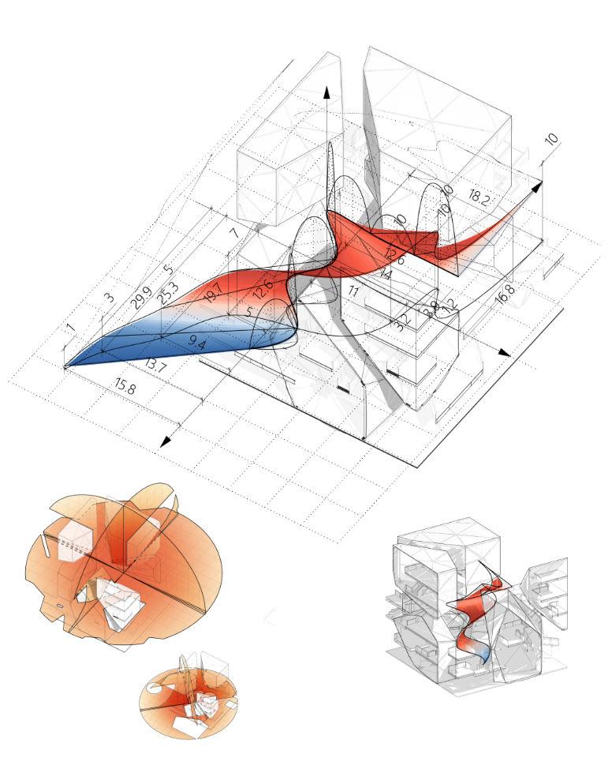
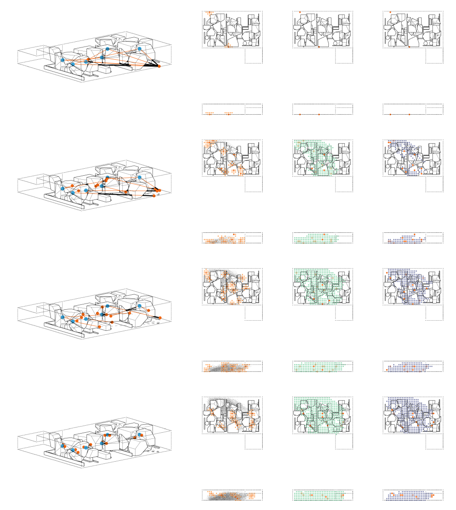

# **人工智能时代下的建筑设计**  *Center ULA: Generative Architectural Design Based on Spatial Programming*

### ——旧建筑改造中的“既要又要”：空间效率与遗产存续的协同生成

> Generative Design, Heritage Adaptation, Spatial Analysis, A* Pathfinding

**联合设计：马昊、沈齐**  
**地点：采荷建筑楼 · 2024.05.27**

大拆大建时代已然终结，大量完成历史使命的既有建筑成为城市更新的核心对象。它们承载社区记忆，却也面临功能过时的困境。如何在提升空间使用效率的同时，最大限度保留建筑遗存，成为当代建筑师的关键课题。传统改造常陷入“去”与“留”的二元权衡，而本设计提出一种“既要又要”的策略——**在最大化可用空间的同时，最小化对既有遗存的干预**。

为实现这一目标，项目引入计算性生成设计方法，构建一套基于空间规划的决策支持系统。通过对场地与遗存进行量化分析，在方案深化前预判可利用空间与冲突区域，从而制定兼顾效率与人文的设计蓝图。

### 潜空间评价体系

研究提出“潜空间”（Latent Space）概念，用以衡量旧建筑中未被激活但具备改造潜力的空间区域。评价体系包含两个核心维度：

1. **视线渗透性**：以四个主要方向（前、后、左、右）的3米视线替代全域视线分析；  
2. **空间可达性**：以无法穿透的实体进行布尔运算，生成有效视线面。

将视线面面积与总分析域面积之比作为潜空间潜力指标。结果通过颜色映射呈现：红色表示视线聚焦（空间深度强），蓝色表示视线开放（空间通透性高）。

进一步以 **4.5 米体素模数** 为基本单元，对潜空间进行离散化评估。数值越低，空间层次越丰富；越高，则空间越开阔。数据以网格面形式可视化：紫色代表高丰富度，黄色代表高开阔度。

### 生成式路径引导与空间组织

以空间丰富度为引导指标，结合 **A\* 寻路算法** 自动生成核心流线。路径宽度与局部空间丰富度建立线性关系——丰富度越高，路径越宽，从而强化潜空间的引导性与体验感。

  

该方法不仅避免了传统改造中反复试错的低效过程，也为旧建筑注入了由数据驱动的空间逻辑。*Center ULA* 展示了一种可能：在人工智能与生成式设计的支持下，建筑改造可以同时拥抱未来功能与历史记忆，实现技术理性与人文关怀的统一。