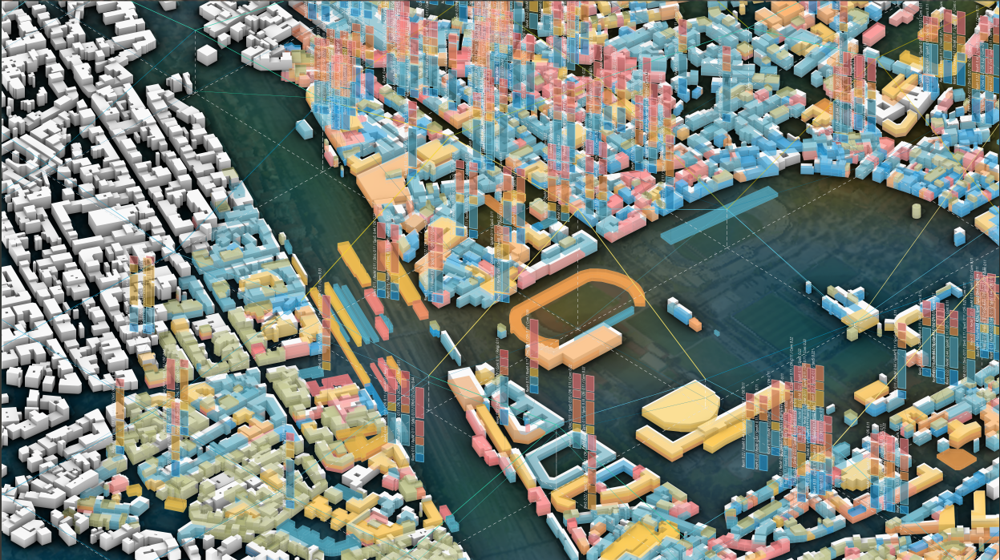
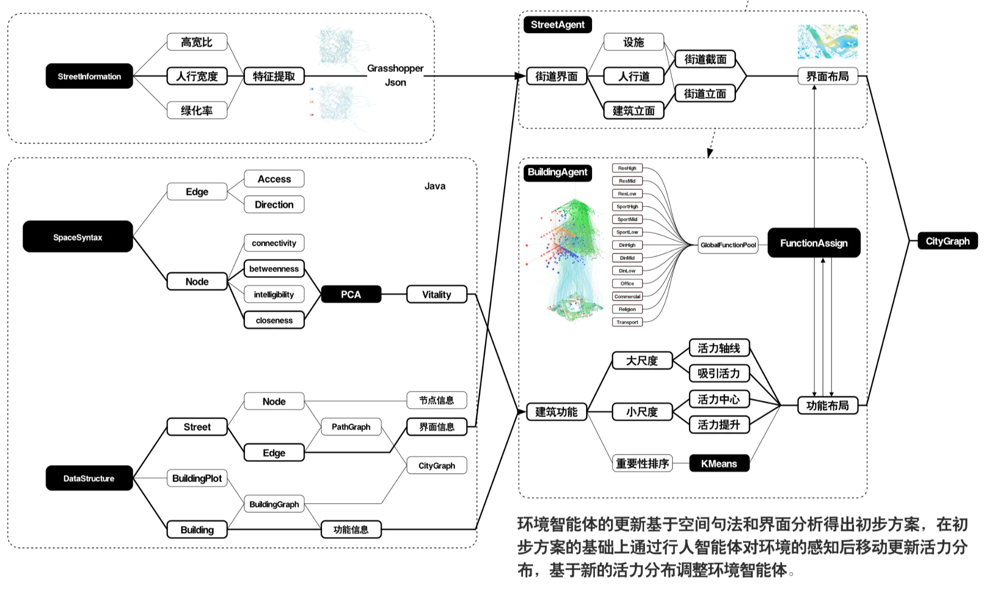
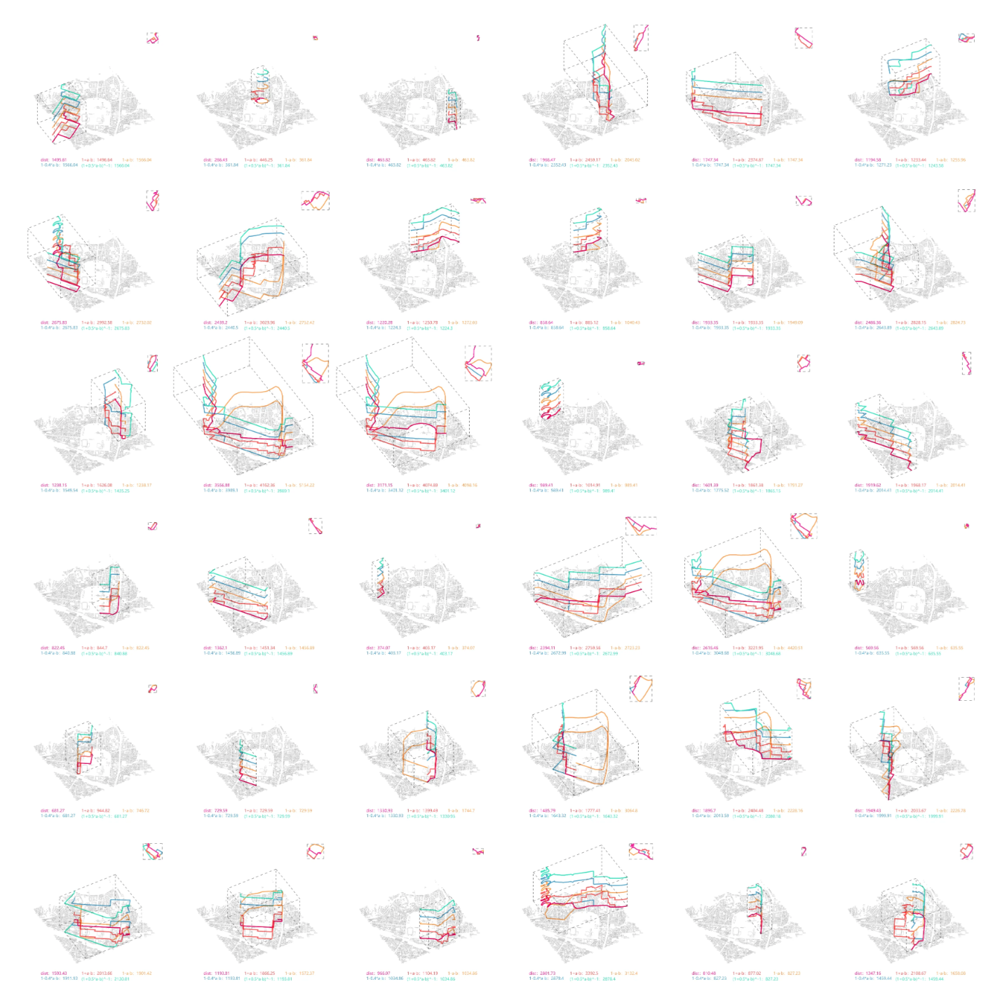
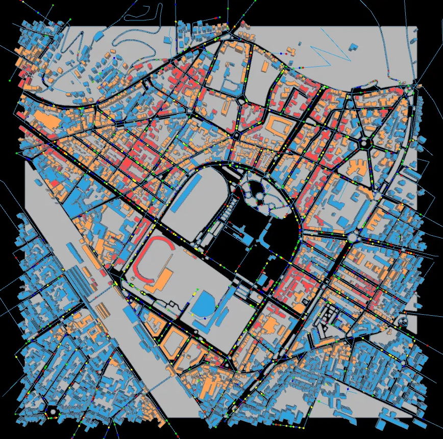

# **佛罗伦萨城市设计**  *City Evolution: Autonomous Urban Adaptation of Pedestrian Space*

### ——基于智能体互动的城市空间自更新实验

> Multi-Agent System, Space Syntax, Processing, Grasshopper, JavaScript

**作者：马昊，冯薇 | 研究生设计课**

本项目以意大利佛罗伦萨历史城区为研究对象，开展一项名为 *City Evolution* 的城市模拟实验，探索公共空间与建筑功能如何通过行人活动与环境反馈实现动态演化。系统构建了两类智能体：**主动智能体（行人）** 与 **被动智能体（空间）**，通过二者持续互动，模拟城市步行空间的自我优化过程——在保留原始业态肌理的基础上，动态调整功能分布与街道环境，以提升整体步行活力。

### 空间句法与街道活力

基于自然人流理论，街道的整合度（integration）与实际活力高度相关。项目从 OpenStreetMap（OSM）与 ArchiJSON 获取道路网络与建筑轮廓数据，在 Java 环境中实现空间句法分析，并对比地理距离、角度距离等不同计算方式对中心度结果的影响。最终选取最能反映真实人流趋势的参数，作为行人智能体移动决策的基础。

### 建筑聚类与功能分配

  

建筑功能的动态分配综合考虑多个属性：空间活力值、建筑层数、体量尺度等。受 K-Means 聚类思想启发，系统将建筑划分为若干类型，并依据活力指标进行功能映射。实验发现，**采用整型指标**（离散分类）可增强功能布局的结构性，而**浮点型指标**（连续变化）更能反映活力梯度的细微差异。最终，通过加权最短距离分配策略，在不同权重组合下生成多轮更新方案，形成具有适应性的城市形态。

*City Evolution* 是一次“自上而下设定规则、自下而上涌现形态”的城市模拟尝试。它揭示了行人行为与空间环境之间的反馈闭环，并为历史城区的渐进式更新提供了一种数据驱动的推演工具。未来工作可进一步深化建筑界面细节、引入时间维度，或结合真实人流数据校准模型，推动模拟向真实干预过渡。