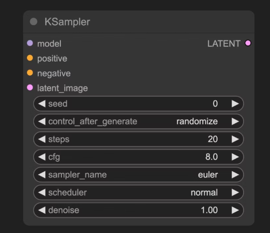

# **效果图生成与参数控制工作流** *AI-driven Workflow for Image-based Rendering and Parameter Analysis*

### ——图生图参数分析

> ComfyUI, Diffusion, ControlNet, KSampler

**本项目围绕 ComfyUI 平台的多阶段图生图流程展开研究，旨在分析与优化从图片到效果图生成的关键控制参数。**

### **项目概述｜ Abstract**
本工作聚焦于 ComfyUI 工作流中图像生成参数的可控性与输出稳定性。
通过建立从线稿提取 → 风格分析 → 模型微调 → 效果生成的全流程节点网络，实现了可复用、可解释的图生图管线。研究重点在于理解参数如何在扩散模型的反向采样中影响视觉特征的生成过程，从而构建一个更为精确的视觉控制体系。

### **工作流搭建与核心逻辑**
.png)

**阶段1预处理**:使用AuxControlNet，提取线稿，准确控制生成效果，使用VAE对原始图像进行编码，形成latent。

**阶段2图像分析**:使用IPAdapter，对输入的效果图进行风格分析，使用style transfer对模型进行针对性修改，使用Florence Prompt Gen对图片进行prompt描述，保持引导力。

**阶段3模型运用**:使用LoRA对Adapt后的模型进行调整，进一步具备风格化能力,并应用ControlNet。

**阶段4效果图生成**：KSampler与VAE解码。

### **参数对比**

在KSampler中有许多的关键参数，关系到模型在生成过程中的步长、步数等，直接影响噪声的添加并最终导向不同的生成结果，如表中所示，通过对不同参数的进行对比分析，能够进一步地精细化地控制模型生成的效果。

| **参数名称** | **描述** | **作用** |
| --- | --- | --- |
| **model** | 去噪使用的扩散模型 | 决定生成图像的风格与质量 |
| **positive** | 正向提示词条件编码 | 引导生成包含指定元素的内容 |
| **negative** | 负向提示词条件编码 | 抑制生成不期望的内容 |
| **latent_image** | 待去噪的潜在空间图像 | 作为噪声初始化的输入载体 |
| **seed** | 噪声生成的随机种子 | 控制生成结果的随机性 |
| **control_after_generate** | 种子生成后控制模式 | 决定多批次生成时种子的变化规律 |
| **steps** | 去噪迭代步数 | 步数越多细节越精细但耗时增加 |
| **cfg** | 分类器自由引导系数 | 控制提示词约束强度（过高导致过拟合） |
| **sampler_name** | 采样算法名称 | 决定去噪路径的数学方法 |
| **scheduler** | 调度器类型 | 控制噪声衰减速率与步长分配 |
| **denoise** | 降噪强度系数 | 控制添加到潜在空间的噪声强度，0.0保留原始输入特征，1.0为完全的噪声 |

### Steps 步数

步数控制了在反向降噪的过程中，模型对图像进行降噪的次数，不同的步骤数对应着不同的生成过程，前期高噪声阶段控制着画面的整体布局，内容等，后期低噪声阶段控制着画面的细节，光影等。步数长短直接影响生成结果，以及生成市场，从30步之后差别较为细微。

### CFG 分类器自由引导系数

CFG Classifier-Free Guidance 这是扩散模型在条件引导中的重要参数，可以理解为提示词对于画面生成的影响，从0~n逐步增强。作用在 prompt 条件引导项（文本条件）和 无条件预测 之间的差向量上，具体如下。

[//]: # ($$)

[//]: # (ϵ~θ=ϵ_θ^{uncond}+s⋅&#40;ϵ_θ^{cond}−ϵ_θ^{uncond}&#41;)

[//]: # ($$)

- s=1：表示普通条件生成；
- s>1：表示更强地朝 prompt 意图推进；
- s<1：表示弱化 prompt 影响，生成更自由。

对生成的影响如图,实验结果表明，CFG 过高会导致画面过拟合、失真；过低则会丢失语义一致性。推荐范围为 5~8 之间。

### **Sampler 采样算法**

不同采样器的是不同的噪声添加的方式，是否具有扩散项，扩散的过程不同影响最终画面的表现，但是对于图生图来说画面的内容是不受采样算法的影响的，采样算法对于生成结果的影响比较细微

| 采样器 | 算法特征 | 风格倾向 / 适用场景 |
| --- | --- | --- |
| **Euler** | 一阶显式欧拉法 | 快速、颗粒感强、略粗糙 |
| **Euler a** | Ancestral 随机欧拉 | 创意性强、细节多样、梦幻感 |
| **Heun** | 二阶修正欧拉 | 稳定干净、平滑自然 |
| **LMS** | 多步线性法 | 连贯性好、适合动画 |
| **DDIM** | 确定性采样 | 快速、风格固定，适合 img2img |
| **PLMS** | 多步线性预测法 | 稍旧、速度快但细节一般 |
| **DPM2** | 二阶 Denoising | 质量较高，过渡平滑 |
| **DPM++ 2M** | 改进多步法 | 当前主流，高保真、锐利 |

### **Scheduler** 调度器

生图过程来说，其他参数一致，模型一致的情况下，不同调度器对与画面的生成有一定的影响，原因来自于不同生成时期噪声的添加的强度：

| 调度器 | 时间步分布 | 特点 | 建议 |
| --- | --- | --- | --- |
| **normal** | 线性衰减 | 均匀稳定，默认选项 | 快速出图、测试用 |
| **karras** | 非线性衰减（初慢后快） | 更细腻、细节平滑 | 高质量生成首选 |
| **exponential** | 指数下降 | 更强调早期结构生成 | 创意性较高 |
| **simple** | 均匀简化 | 实验用 | 不推荐日常使用 |

### Denoise 降噪

denoise参数是生成过程中关键的控制参数，可以简单地理解为画面重绘的比例，范围0~1，0表示不改变画面，1表示完全从噪声开始生成。

denoise参数的0~1实际上是对生成步长范围的控制，如Steps=100，denoise=0.5，那就从Step=50的时候开始进行降噪，即控制“我们从多靠近纯噪声的位置开始去噪”。

[//]: # ($$)

[//]: # (x_{t_{\text{start}}} = \sqrt{\alpha_{t_{\text{start}}}}\, x_0 + \sqrt{1 - \alpha_{t_{\text{start}}}}\, \epsilon)

[//]: # ()
[//]: # ($$)

---

### **结论**

该项目基于 ComfyUI + Diffusion 模型框架，完成了从线稿到高保真效果图的参数化生成探索。
通过系统对比 Steps、CFG、Sampler、Scheduler、Denoise 等参数，研究揭示了它们在不同生成阶段的互相作用关系。
项目验证了扩散模型的参数可解释性与可控性，为设计师与研究者提供了更科学的图像生成调优方法，也为未来的可控生成研究提供了数据与逻辑支撑。