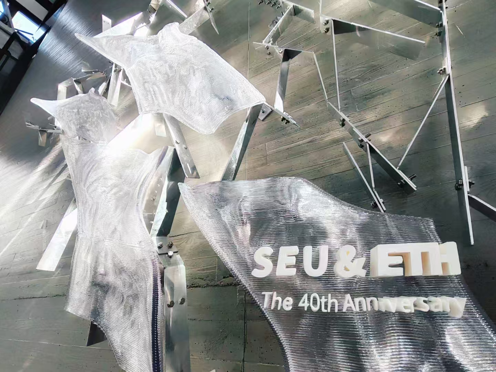
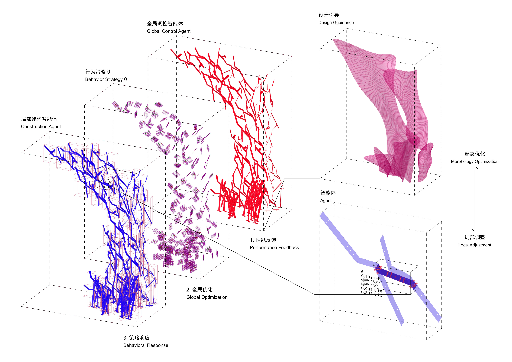
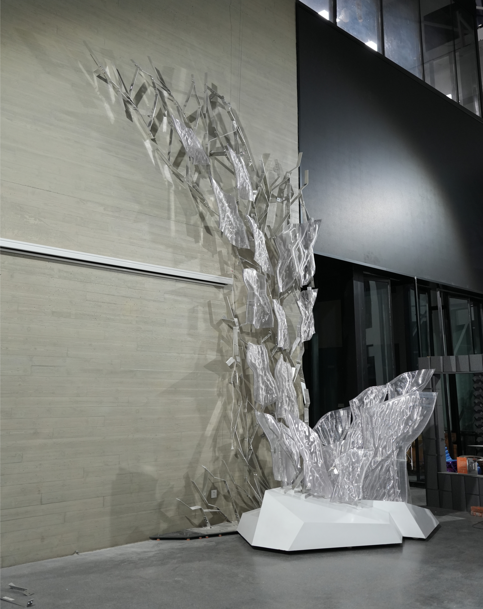

# **生形融合工作营**  *“Morphusion: Composite Sprawling” — Sino-Swiss Digital Fabrication Workshop Celebrating 40 Years of Collaboration*

### ——AI生成、参数化建模与高精度建造的协同实践

> Digital Fabrication, Grasshopper, Python, Robotic 3D Printing, AR Construction

**方案/建造主持设计：** 王大嵩  
**参与教师：** 华好、李飚、唐芃、李力、杨波、李鸿渐  
**参与学生：** 段成璧、王颖旭、马昊、陈崚川、唐烨、程昱浩、田宇琪、刘思洁、景子健、刘江龙、李镜如、帅直、王潆杉、黄喆、赵雨婷、吴浩朴

在AI与数字建造技术快速发展的背景下，建筑设计正逐步摆脱标准化形式的束缚。项目“形态融合：复合蔓生”（*Morphusion: Composite Sprawling*）作为东南大学与苏黎世联邦理工学院（ETH Zurich）合作四十周年的纪念性工作营成果，探索了人工智能生成内容（AIGC）与数字建造的深度融合。通过Stable Diffusion等工具生成初始形态，结合参数化建模、数控弯折金属框架与机械臂3D打印技术，构建了一套自然、有机且结构合理的复合建筑体系，实现了从算法生成到实体落地的完整闭环。

### 核心技术路径：从几何优化到可建造性

  

项目核心在于将AI生成的复杂曲面转化为可高精度建造的构件。通过 Grasshopper 与 Python 联合开发，对结构性能驱动的几何形体进行优化，并输出可用于数控加工的图纸。在此过程中，**控制建造误差**与**提升制造效率**成为关键挑战，主要源于两方面：一是曲面偏移导致的几何失真，二是铝型材弯折时因材料韧性造成的角度偏差。

#### 偏移控制

  
*红色：设定板厚；蓝色：实际偏移曲面*

为避免误差累积，构件实体化过程采用**内侧偏移策略**，将几何偏差控制在构件内部。同时，通过自定义偏移向量方向（见下图），实现对局部厚度与挤出方向的精细调控，确保制造一致性。

  

#### 构件制造与折痕识别

构件需经历多角度弯折，内外折痕的正确识别至关重要。错误的折痕方向将导致构件无法装配。项目通过向量叉积判断曲面法向，自动区分内外折痕，并赋予不同标记。在此基础上完成构件编号、展平与信息嵌入，最终实现**零错误制造**。

结构线经整理后归为七类：其中四类为标准模块，包含左臂、右臂、连接臂与基础平面；其余三类为Custom构件，用于主体框架的连接与加固。

### 落地建造与AR辅助装配

建造阶段采用 **Fologram 进行 AR 实景辅助装配**，结合构件设计中预留的调整余量，显著提升了现场安装精度。得益于前期精细化的参数化控制，钢框架搭建迅速且与预埋件高度对齐，验证了“设计即建造”理念的可行性。

该作品现已永久落成于东南大学道桥实验室一楼中庭，作为两校四十年学术合作的实体见证。*Morphusion* 不仅是一次技术实验，更是一次关于未来建筑语言的推测性探索——在AI生成、算法控制与数字制造的交汇处，寻找自然、有机与结构理性共存的新可能。