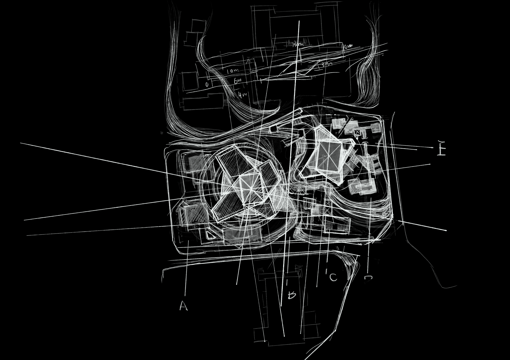

# **剧场设计**  *Wind Valley Theatre Design*

### ——从戏剧认知到空间生成的算法探索

> Grasshopper, Rhino, Kangaroo, VisualARQ

本设计以“戏剧性空间”为切入点，反思将特定戏剧情节直接转译为空间形式的局限性。剧场不应绑定于某一部剧作，而应从戏剧的本质——人的观看、感知与情感响应中抽象出普适的空间逻辑，并通过算法工具实现感性体验与理性建构的融合。

### 感性与理性：算法与选择

设计尝试回归人认识戏剧的基本方式：无论是观看影像还是现场演出，观众主要通过视线追踪演员，并结合声音、灯光、动作等线索构建对剧情的理解。通过对视线路径与情感强度的关联分析，发现**透视变换的节奏与情感起伏高度相关**，由此建立一套基于视觉体验的建筑情感评价体系，用于指导空间形态的生成。

#### 情感与视线
  

在此基础上，将剧场平面的生成规则参数化，并嵌入上述情感评价指标。通过多目标遗传算法进行优化，生成一系列候选方案。然而，算法本身无法完全捕捉情感的复杂性，其输出仅提供“不差”的解集。最终方案的选择依赖于设计师对形态合理性、空间流畅性与体验连贯性的综合判断——这是一种经验性的、感性的决策过程。

正如林哲老师所言：“算法设计不会得出最好的答案，但可以得到不差的答案。” 本项目正是在理性计算与感性直觉之间谨慎寻求平衡，力求从多维度逼近更优的空间解。

### 空间与结构

屋顶采用膜结构，通过 Kangaroo 的 Circle Packing 算法实现自承重形态优化；大跨度由钢骨架支撑，上部设备层以悬吊方式处理，并延伸为面向山谷的观景平台，使剧场不仅是表演容器，也成为观景媒介。

### 最终效果

