# WebGPU 体积雾渲染引擎：踩坑记录*Engineering Volumetric Fog in WebGPU*

> WebGPU · Three.js · Volume Rendering · Real-time Lighting

**本文记录了一次从零开始、基于 WebGPU 的体积雾渲染引擎工程实践。项目围绕真实感体积光（Volumetric Lighting）的实现路径展开，对不同技术方案进行多轮迭代与验证，重点分析其在视觉效果、遮挡逻辑与性能稳定性上的取舍，并系统性总结踩坑经验。**

---

### **项目概述｜Content**

体积雾（Volumetric Fog）是实时渲染中最具表现力、同时也是最容易失控的效果之一。在 WebGPU 环境下，由于算力、API 成熟度与浏览器兼容性的限制，传统桌面级实现方案往往难以直接迁移。
本项目尝试在 **Three.js + WebGPU Renderer** 框架下，构建一个 **轻量、稳定、可调试** 的体积雾渲染系统，用于支持：

-多光源场景下的体积光（丁达尔效应） <br>
-正确的几何遮挡与深度关系 <br>
-可控的性能开销，适配 Web 端实时交互需求

项目经历了 **三次核心方案迭代**：从完全自定义 Shader，到光线步进优化，再到基于官方 VolumeMaterial 的工程化落地。

## **一、引擎核心功能概览｜Engine Capabilities**

### **核心渲染能力**

**多格式模型支持**：支持常见 3D 模型格式（OBJ, GLB, FBX,3DM）导入，支持动画的显示。
**多层级光照系统**：基础环境光 + 全局平行光 + IBL 环境光照 + 浮动点光源 + 聚光灯。
<br>1. 环境光（Ambient Light），均匀地照亮整个场景所有物体，没有方向性，不会产生阴影。
<br>2. 平行光（DirectionalLight），类似太阳的平行光，通过shadowmap产生阴影。
<br>3. 图像照明（Image-Based Lighting)，通过加载HDR贴图照亮场景，可以调整强度实现不同的光照效果，也支持上传不同的HDR文件实现不同的照明效果。

<br>4. 点光源（PointLight），基于时间间隔与正弦函数控制灯光坐标，实现动态浮动光影。
<br>5. 聚光灯（SpotLight），通过摄像机位置控制灯光坐标与目标，实现手电筒与固定位置两种照明方式，支持锥体大小、灯光强度、颜色的自定义。


这些光源不仅用于基础照明，也作为体积雾散射计算的输入条件。

### **交互与体验优化**
三种灯光交互模式：
<br>1. 浮动灯光：通过正弦函数控制灯光坐标，实现动态浮动光影效果
<br>2. 固定聚光灯：支持拖拽调整灯光位置，满足固定场景照明需求
<br>3. 手持聚光灯：模拟手电筒模式，灯光随视角移动，适配沉浸式场景观察

视角交互：
支持环绕、步行、飞行三种视角模式切换，可通过鼠标 / 键盘控制场景漫游


调试模式支持：
提供法线着色、线框、深度图检查以及正常渲染四种模式切换


## **二、体积雾渲染核心开发迭代**
### **第一版：ShaderMaterial 视锥体方案**

**实现思路**：采用自定义 ShaderMaterial，将体积雾抽象为视锥体，通过烟雾算法计算雾效，兼顾渲染速度

```python
fragmentShader | 锥体+volumetricShader 自定义材质实现 
float alpha = fresnel * verticalFade * coreFade * uOpacity;  # 菲涅尔边缘柔化 * 衰减因子
alpha *= (0.8 + 0.4 * noiseVal);  # 为 alpha 添加随机噪波变化
gl_FragColor = vec4(uColor, alpha);  # 最终输出片段颜色：RGB 来自 uniform 变量 uColor
```

**核心问题**：

1. 视觉效果局限：
    体积雾呈 “片状”，类似蒙在镜头前的雾层，缺乏立体感，无法体现物体对光照的遮挡效果
    全局雾气与灯光联动性差，全局环境无法影响灯光的丁达尔效应，光影氛围不真实
2. 技术缺陷：因使用背面渲染（Backside Rendering），当视角处于视锥体内时，会出现底部穿模现象，且物体与雾层的遮挡关系处理错误

**采坑记录：**

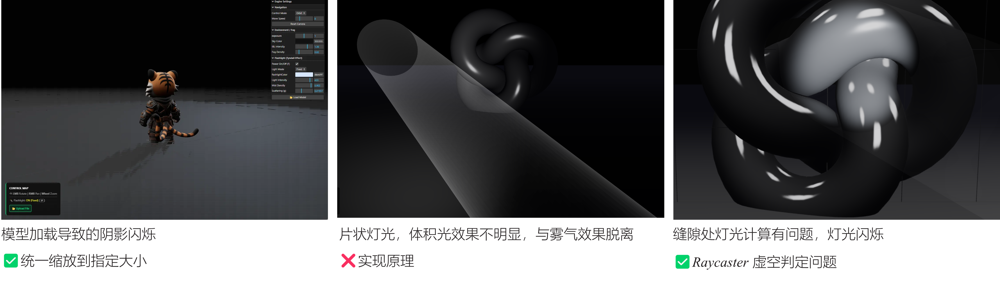

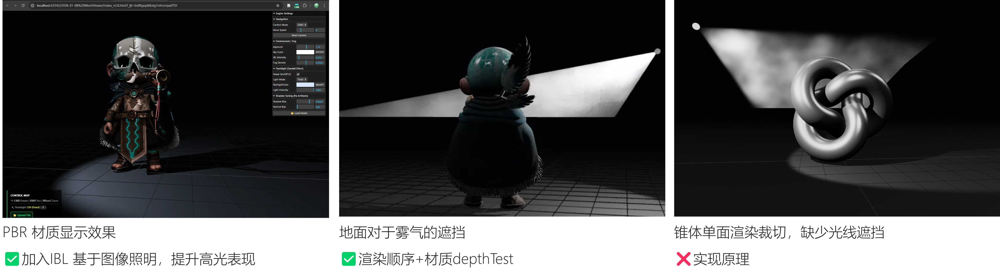

---
### **第二版：ShaderMaterial 光线步进方案**

**实现思路**：使用一个巨大的 Box（volMesh）包裹场景，作为体积光的采样区域。在几何容器内沿视线步进，对每个点做光照+阴影判断，累加散射贡献，最终以加法混合输出光束。
<br>1. 获取场景深度
<br>2. 光线步进→ 在聚光灯锥角内，在有效距离内
<br>3. 阴影判定→ uShadowMap 和 uShadowMatrix（光源视角投影矩阵）将 currentPos 投影到光源空间，比较深度
<br>4. 光照累加→ totalLight += falloff * coneFade * (0.3 + phase * dust)
<br>5. 最终输出→ finalAlpha = 1.0 - exp(-totalLight) | vec4(uColor * finalAlpha, finalAlpha)

**迭代方向**：仍基于 ShaderMaterial，优化雾效立体感与遮挡逻辑
**关键调整**：将体积雾视锥体改为矩形 Box，在 Box 内通过光线步进（Ray Marching）算法计算雾效
**关键问题**：
<br>1. 继承第一版缺陷：全局雾气与灯光仍无法联动，丁达尔效应与环境雾融合不自然
<br>2. 新阴影问题：因 Shadow Map 二维投影特性，光线步进时误将 “光线未到达物体的区域” 判定为遮挡，导致阴影显示异常
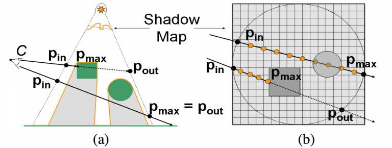
图片来源：[https://www.mpcvfx.com/en/news/volumetric-shadow-mapping/](https://www.mpcvfx.com/en/news/volumetric-shadow-mapping/)
<br>3. 性能瓶颈：自定义 ShaderMaterial 在复杂场景下，光线步进计算量大，渲染帧率不稳定
**采坑记录：**
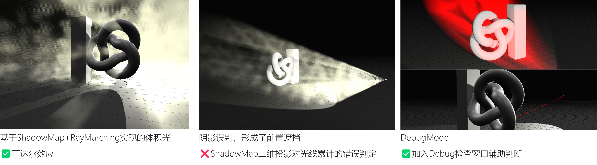

---
### **第三版：VolumeMaterial+PostProcessing方案**

**解决方案**：改用 Three.js 官方 VolumeLighting 示例，替代自定义 ShaderMaterial
[three.js examples](https://threejs.org/examples/?q=VOLUME#webgpu_volume_lighting)
**实现思路**：通过分层渲染 + 3D 噪声纹理 + 节点化光线步进 + 后处理合成实现体积雾效果。

**第一阶段：场景预处理与深度捕获**

在计算体积光之前，必须了解场景的几何遮挡关系。
<br>**深度剥离**：通过 `scenePass` 渲染主场景，并将深度缓冲（Depth Buffer）转换为纹理。
<br>**遮挡逻辑**：在体积材质中，通过 `scenePass.getTextureNode('depth')` 采样。如果当前光线步进的点深度超过了场景深度，则停止光照累加。这确保了雾气能够正确地“躲”在墙体后面。
    
**第二阶段：定义体积介质 (Medium Definition)**

3D 数据场：使用 `ImprovedNoise` 生成 128  X 128 X 128 的 Data3DTexture。这形成了一个三维空间的密度场。
动态位移：在 `scatteringNode` 中，利用 `time` 变量对采样坐标进行偏移：
    
第三阶段：核心算法——光线步进 (Raymarching)
<br>1. 射线投射：当渲染 `volumetricMesh`（体积盒子）时，为每个像素从相机位置发射一条射线。
<br>2. 等距采样：在射线进入和离开盒子的范围内，进行 `15` 次迭代采样。
<br>3. 抖动优化 (Dithering)：
- 问题：步进次数仅 15 次，会导致明显的色带（Banding）。
- 对策：引入 `bayer16` 蓝噪声对每条射线的起始位置进行随机微调。
- 效果：将规则的阶梯状伪影转化为高频噪点，这些噪点在后续的模糊处理中会被消除。
<br>4. 光照累加：在每个采样点，系统会自动计算当前点到光源（`pointLight`, `mainSpotLight`）的距离与衰减，并结合 3D 噪声密度得出该点的颜色贡献。

**第四阶段：低分辨率渲染与合成 (Composition)**
 
- 降采样：体积计算在 1/4 分辨率下进行，减少 75% 的像素计算量。
- 模糊平滑：对带噪点的体积层进行高斯模糊，使其呈现柔和的光晕感。
- 混合叠加：使用加法混合（Additive Blending）将体积光层叠加到原始渲染图层之上。

**核心改进**：
1. 效果优化：
- 体积雾立体感显著提升，可正确处理物体与雾层的光照遮挡关系，消除穿模问题
- 实现全局雾气与灯光丁达尔效应联动：全局雾气既能影响整体环境色调，又能与灯光交互，让丁达尔效应随雾浓度自然变化
2. 技术修复：VolumeMaterial 底层基于光线步进算法，通过Bayer 16纹理压缩优化烟雾采样，解决了前两版的阴影误判问题，阴影显示准确自然
3. 性能提升：经过底层优化，在保持效果的同时，渲染帧率更稳定，适配 WebGPU 轻量化需求

**调试工具实现**
1. 方案一：新增专用深度材质（Depth Material），将 Shadow Map 的深度纹理（Shadow Texture）赋予该材质，再将材质绑定到相机视角下的 2D 面片，实现深度图实时预览
2. 方案二：后处理（Post-processing）叠加：在相机主画面渲染完成后，通过后处理遮罩（Mask）控制，将深度图作为第二层画面叠加在主画面上方，需注意：
- 混合模式设置：确保 HUD 层与主画面的 RGB 颜色混合方式正确
- Alpha 通道处理：统一两层画面的 Alpha 通道预乘设置，避免透明区域显示异常
- 渲染顺序：需保证后处理层在主画面渲染完成后执行，避免深度冲突

**采坑记录：**
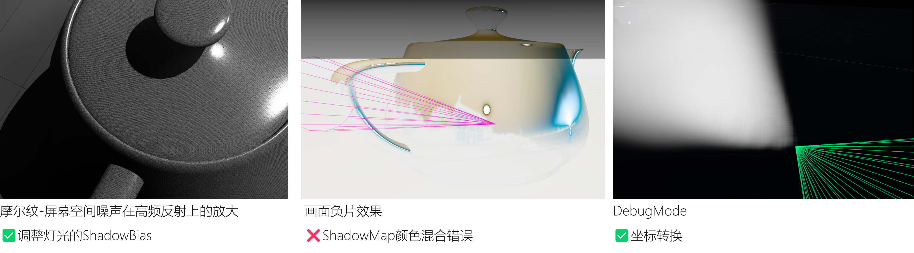

## 三、总结

开发过程中，从完全自定义 ShaderMaterial 到改用官方 VolumeMaterial，核心收获在于：
1. 避免重复造轮子：官方材质已解决大部分 WebGPU 渲染兼容问题，比自定义 Shader 更稳定，尤其适合 Web 环境轻量化需求，但是自定义shader的学习仍然不可或缺，以后可以继续尝试基于自定义Shader进行实现。
2. 技术优先级明确：对于体积雾这类复杂效果，优先验证官方示例方案，再基于业务需求二次开发，可大幅减少踩坑时间

## 渲染效果
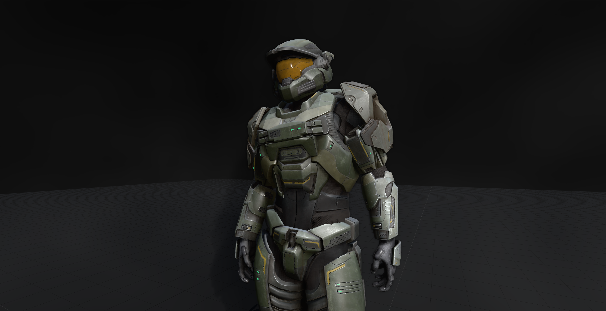
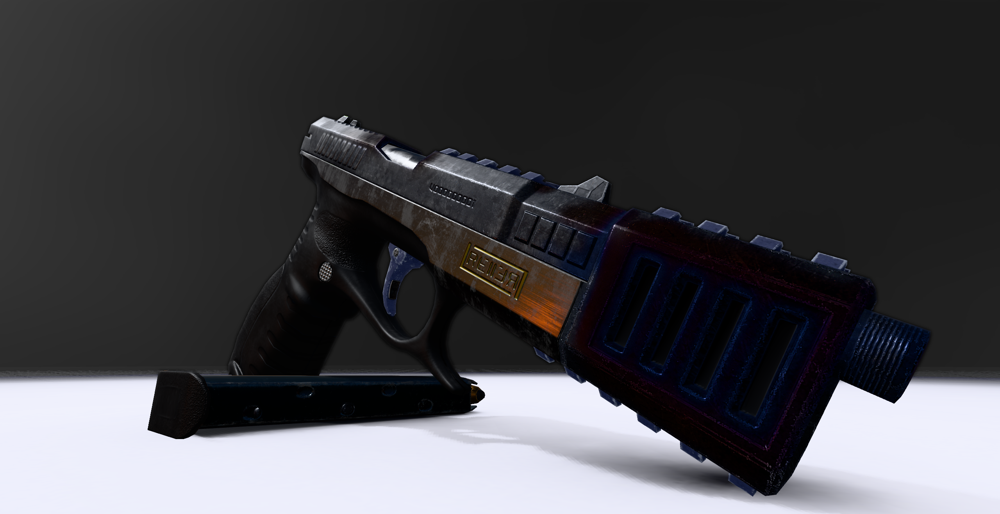
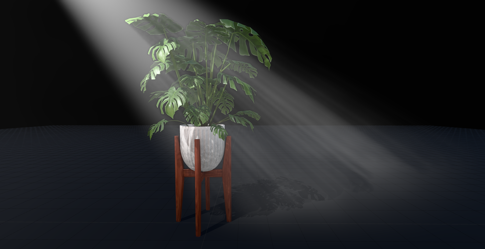
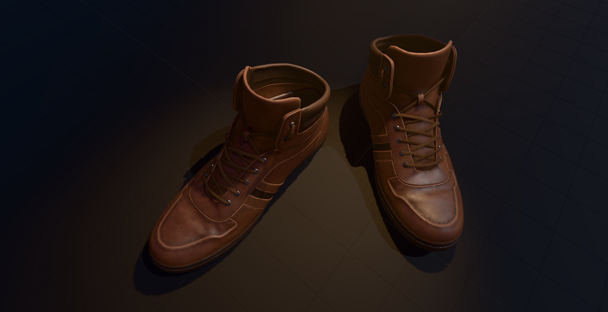
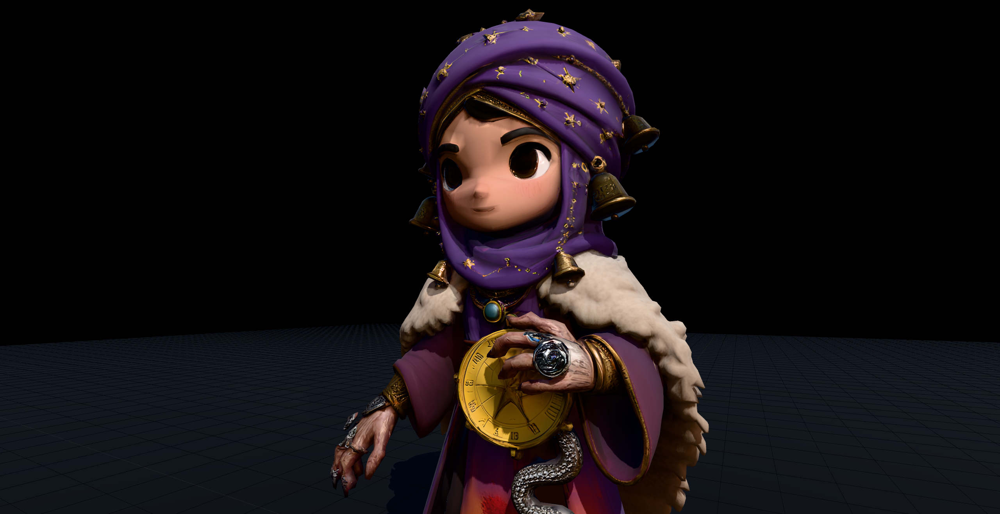
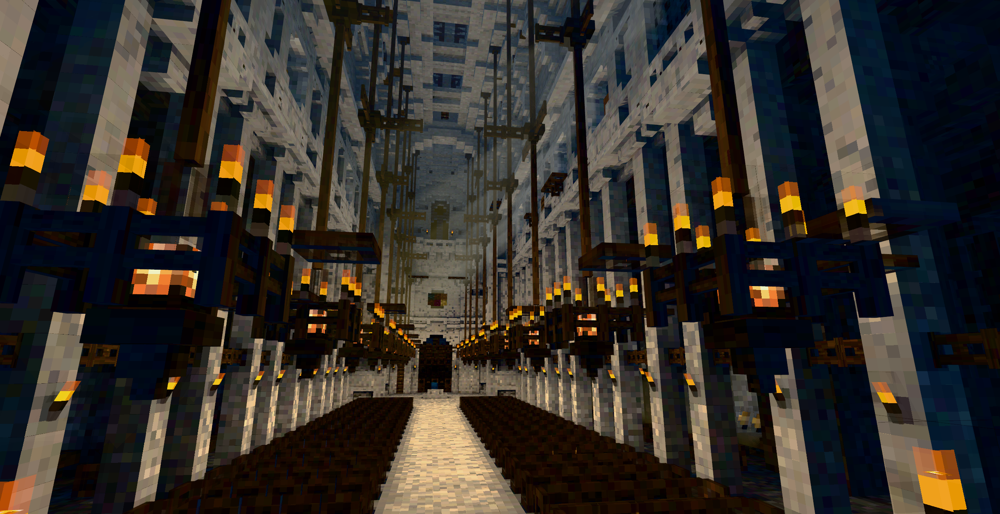
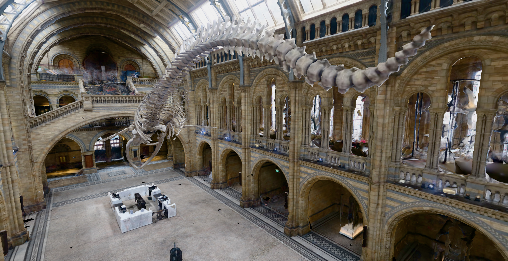